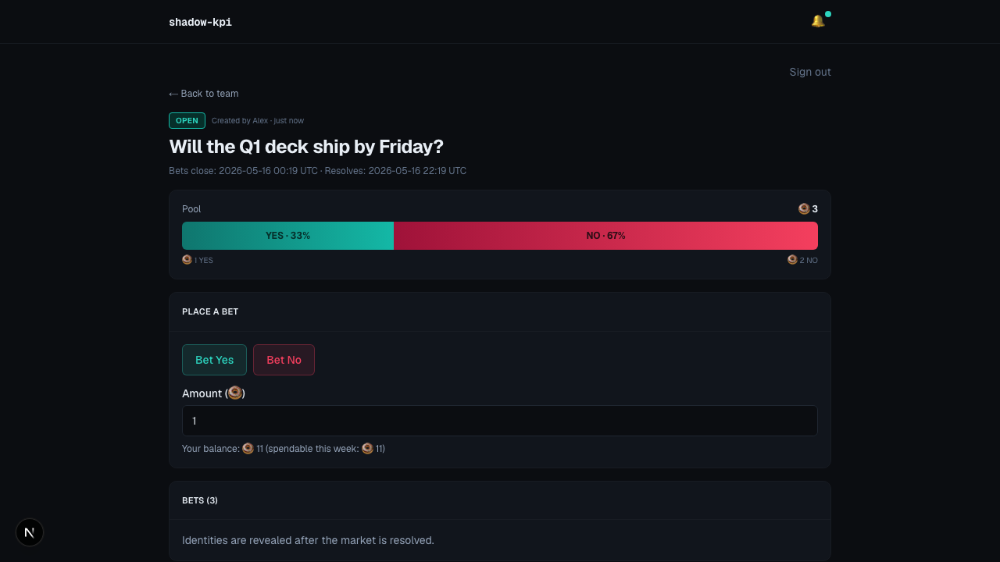
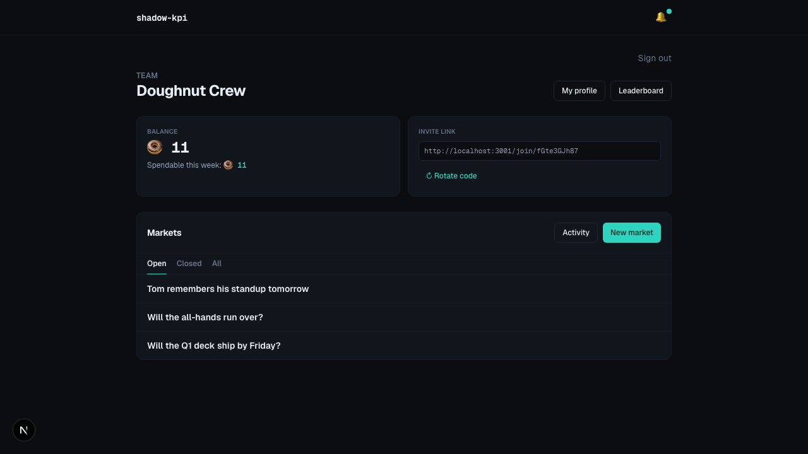
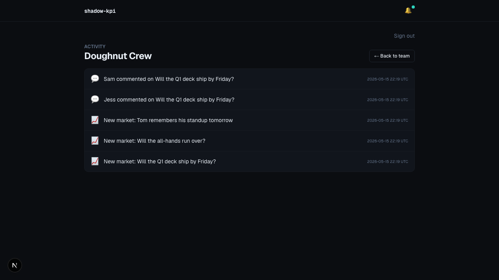
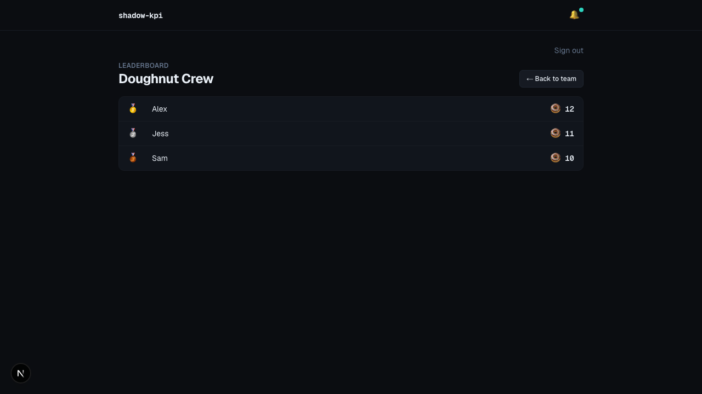
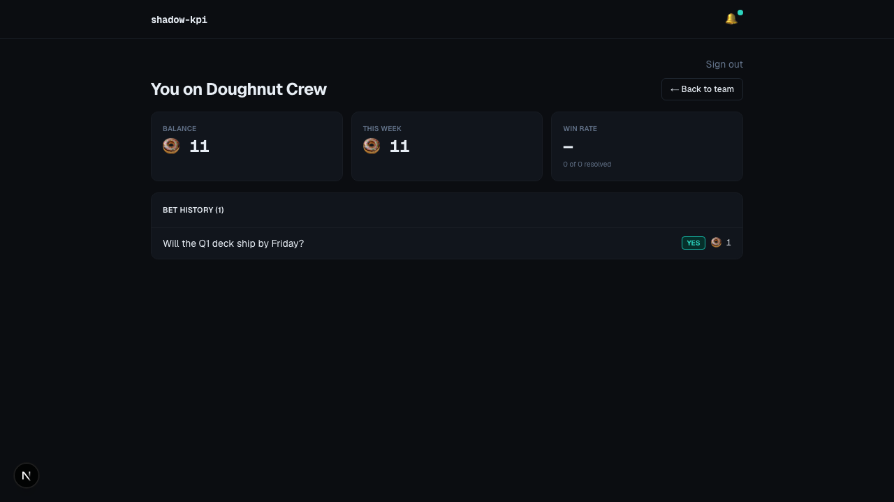
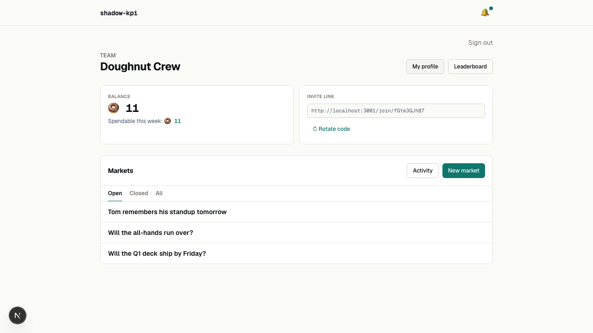

<div align="center">

# 🍩 shadow-kpi

**Bet doughnuts on what happens at work.**

[](LICENSE)
[](https://www.typescriptlang.org/)
[](https://nextjs.org/)
[](#-tests)
[](#-docs)

</div>

<p align="center">
  
</p>

---

## 🍩 What is this?

A workplace prediction market where teammates bet **doughnuts** (a fake virtual currency — no real money, no real gambling, no SEC interest) on the binary "will X actually happen?" questions that come up at every job.

> *"Will the Q1 deck ship by Friday?"*
> *"Will the all-hands run over again?"*
> *"Will Tom remember his standup tomorrow?"*

Each market is a parimutuel pool. You get **12 fresh doughnuts every Monday**, unspent ones evaporate (use 'em or lose 'em), but stakes and winnings carry forward. Markets lock at a set time, the creator calls the outcome, and the pool gets paid out to the winning side — proportional to your stake, with dust assigned deterministically so the books always balance.

Each team is its own island: invite codes, scoped balances, scoped leaderboard. Email-magic-link auth, no passwords. Two color modes that follow your OS. Looks like Polymarket; runs like a small Next.js app you can self-host in a weekend.

---

## 🚀 Quick start

```bash
git clone git@github.com:ballance/shadow-kpi.git
cd shadow-kpi
docker compose -f docker-compose.dev.yml up -d postgres
nvm use                       # Node 22 (pinned via .nvmrc)
cp .env.example .env.local    # edit the placeholders before signing in
npm install && npm run db:migrate
npm run dev                   # → http://localhost:3333
```

Pour a coffee. Land on the landing page. Get a magic link, sign in, create a team, share the invite URL, start asking questions.

---

## ✨ Features

<table>
<tr>
<td width="50%" valign="top">

### Parimutuel markets

Binary YES/NO markets with proportional payout. Pool totals visible while open; bettor identities reveal only after resolution. Creator can't bet on their own market — so they can't tilt the line they're about to call.

</td>
<td width="50%" valign="top">

### Weekly doughnut allowance

Twelve doughnuts every Monday at 9am local. Unspent allowance evaporates; stakes and prior winnings persist. A Vercel cron + idempotent ledger entry keeps the reset honest across deploys.

</td>
</tr>
<tr>
<td width="50%" valign="top">

### Team-scoped everything

Invite-code teams. Your balance, your leaderboard rank, your bet history — all per-team. One person can be in multiple teams; each has its own economy.

</td>
<td width="50%" valign="top">

### In-app notifications + comments

Bell badge fires when a market you bet on locks/resolves/voids, when someone comments on a thread you're in, or when a new market lands in your team. Comments live on each market — oldest-first thread with optimistic identity.

</td>
</tr>
<tr>
<td width="50%" valign="top">

### Activity feed + leaderboard

Per-team timeline of the last 50 events (markets created, comments posted, outcomes called). Leaderboard ranks by current balance with 🥇🥈🥉 for the podium.

</td>
<td width="50%" valign="top">

### Polymarket-vibe styling

Dark navy + teal/coral hero bar, Geist Mono wordmark, mobile-clean down to 375px. Follows your OS color scheme; both modes hit WCAG AA on every token combination.

</td>
</tr>
</table>

### Dashboard

<p align="center"></p>

### Activity feed

<p align="center"></p>

### Leaderboard & Profile

<p align="center">
  
  &nbsp;
  
</p>

### Both color modes, no toggle

<p align="center"></p>

---

## 🏗️ How it works

### Pool math (parimutuel + dust)

When a market resolves, the entire pool is split among winners proportional to stake. Doughnuts are integers, so proportional payouts never divide cleanly — `pool * stake / winningSide` leaves remainder. The remainder ("dust") is assigned deterministically to the earliest bettor on the winning side, so the books reconcile to the doughnut. See `src/server/payouts.ts`.

### Concurrency

Concurrent bets on the same market are serialized with `SELECT ... FOR UPDATE` on the market row before any pool aggregation. Drizzle handles the typed read; raw SQL handles the lock. The two-step keeps Postgres happy (`FOR UPDATE` is illegal alongside aggregate functions) and the types honest. See `src/server/bets.ts`.

### Events + cron

The domain emits events (`MarketCreated`, `MarketLocked`, `MarketResolved`, `MarketVoided`, `CommentPosted`) onto an in-process event bus. The notification subscriber fans them out to per-recipient `notification` rows. Vercel cron pings two endpoints — `/api/cron/weekly-reset` Monday at 9am, `/api/cron/lockup-sweep` every five minutes — both bearer-token authed. See `src/server/events.ts`, `src/server/weekly-reset.ts`.

---

## 🧪 Tests

| | Count | Stack |
|---|---|---|
| Unit + integration | **110** | Vitest 4 · testcontainers-postgresql (isolated DB per integration test file) |
| End-to-end | **4** Playwright specs | signup-and-join · full-game-loop · void-and-leaderboard · social-and-leaderboard |
| Production deps mocked in tests | **0** | Real Postgres, real auth flow (file-shim for magic links), real cron auth |

```bash
npm test                # unit + integration (spins up isolated Postgres via testcontainers)
npm run test:e2e        # full Playwright suite against the e2e Postgres on port 5433
npm run typecheck       # tsc --noEmit, strict mode
```

Every commit on `master` keeps all three green. The plan-driven workflow (see [Docs](#-docs)) means no feature lands without tests passing.

---

## 📁 Project layout

```
shadow-kpi/
├── src/
│   ├── app/                          # Next.js App Router pages + route handlers
│   │   ├── (app)/                    # authenticated routes (teams, markets, profile, activity, leaderboard)
│   │   ├── (auth)/                   # signin, check-email
│   │   ├── api/                      # auth callbacks, cron endpoints, notification mark-read
│   │   └── join/[code]/              # invite acceptance page
│   ├── components/                   # React components
│   │   └── ui/                       # restyled shadcn primitives
│   ├── lib/                          # cn() + small utilities
│   └── server/                       # domain layer — no React imports
│       ├── db/                       # Drizzle schema + migrations + client
│       ├── auth.ts                   # Auth.js v5 with Drizzle adapter, custom Resend sender
│       ├── bets.ts                   # SELECT FOR UPDATE bet placement
│       ├── payouts.ts                # parimutuel split + dust assignment
│       ├── events.ts                 # in-process event bus
│       ├── notifications.ts          # event subscriber + read-side helpers
│       ├── comments.ts               # comment service
│       ├── activity.ts               # team activity feed (merges markets + comments)
│       ├── markets.ts                # create / lock / resolve / void
│       ├── ledger.ts                 # balance + spendable-allowance queries
│       ├── weekly-reset.ts           # Monday cron: refresh allowance, persist winnings
│       └── profile.ts                # per-team bet history + win rate
├── tests/
│   ├── unit/                         # vitest unit tests
│   ├── integration/                  # testcontainers-Postgres integration tests
│   ├── e2e/                          # Playwright specs
│   └── screenshots/                  # README screenshot capture
└── docs/superpowers/                 # design specs + implementation plans (see below)
```

---

## 📚 Docs

This project was built spec-first, plan-driven, subagent-implemented. Every feature has a written design and a step-by-step plan; both are checked in.

| Phase | Spec | Plan |
|---|---|---|
| Product design | [shadow-kpi-design](docs/superpowers/specs/2026-05-12-shadow-kpi-design.md) | — |
| Foundation + identity | (in design) | [plan-1](docs/superpowers/plans/2026-05-12-shadow-kpi-plan-1-foundation-identity.md) |
| First market end-to-end | (in design) | [plan-2](docs/superpowers/plans/2026-05-12-shadow-kpi-plan-2-first-market.md) |
| Economy completeness | (in design) | [plan-3](docs/superpowers/plans/2026-05-12-shadow-kpi-plan-3-economy-completeness.md) |
| Social + polish | (in design) | [plan-4](docs/superpowers/plans/2026-05-12-shadow-kpi-plan-4-social-and-polish.md) |
| Styling redesign | [styling-design](docs/superpowers/specs/2026-05-14-shadow-kpi-styling-design.md) | [styling-plan](docs/superpowers/plans/2026-05-14-shadow-kpi-styling-plan.md) |
| README polish | [readme-design](docs/superpowers/specs/2026-05-15-readme-design.md) | — |

If you want to know **why** a thing is shaped the way it is, the spec answers it. If you want to know **how** it was built, the plan does.

---

## 🪟 Reproducing the screenshots

The images in this README are real — captured from a running app, not mockups.

```bash
docker compose -f docker-compose.dev.yml up -d postgres-e2e
npm run screenshots          # outputs to docs/img/*.png
```

Behind the scenes that runs a Playwright spec (`tests/screenshots/capture.spec.ts`) which seeds an isolated database, creates a team with three users and three markets, places bets, posts comments, then visits each route at 1280×720 and saves PNGs. Light-mode shot uses `page.emulateMedia({ colorScheme: 'light' })`.

---

## 📄 License

MIT — see [LICENSE](LICENSE). Fork it, run it at your company, change the currency to bagels, whatever.

---

## 🙏 Built with

[Next.js](https://nextjs.org/) 16 · [TypeScript](https://www.typescriptlang.org/) (strict) · [Drizzle ORM](https://orm.drizzle.team/) · [Auth.js](https://authjs.dev/) v5 · [Resend](https://resend.com/) · [shadcn/ui](https://ui.shadcn.com/) · [Geist](https://vercel.com/font) · [Tailwind v4](https://tailwindcss.com/) · [Playwright](https://playwright.dev/) · [Vitest](https://vitest.dev/) · [testcontainers](https://testcontainers.com/)

<p align="center"><sub>If you ship shadow-kpi at your job, send a screenshot. I want to know.</sub></p>
